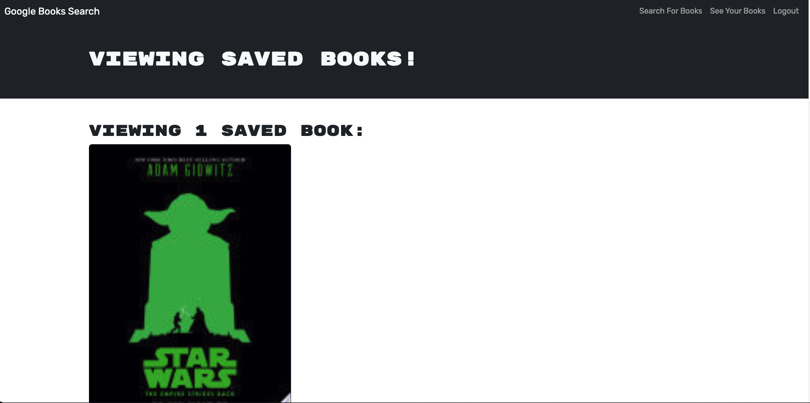
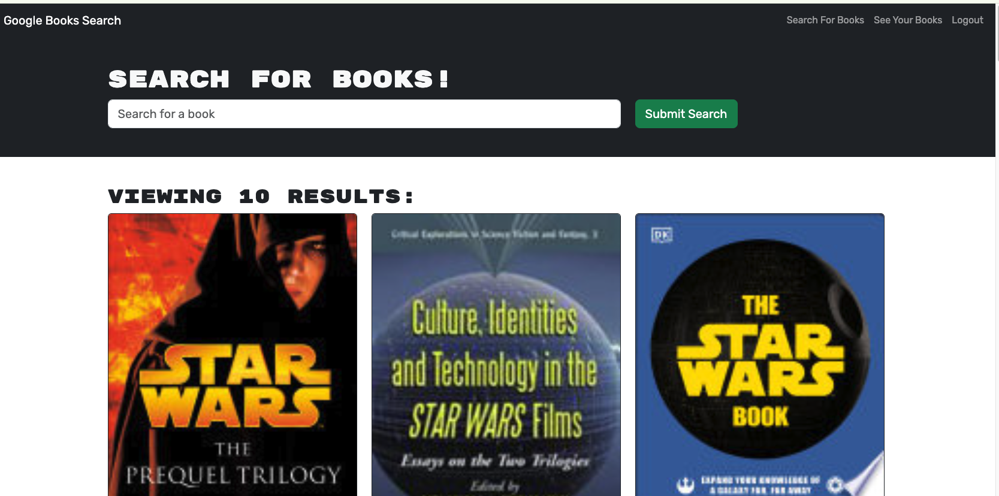

# Book-Search-Engine

## Table of Contents

- [Description](#description)
- [User-Story](#user-story)
- [Questions](#questions)
- [Links](#links)
- [Images](#images)

## Description

A fully functioning Google Books API search engine built with a RESTful API, refactored into a GraphQL API built with Apollo Server.

## User-Story

AS AN avid reader
I WANT to search for new books to read
SO THAT I can keep a list of books to purchase

## Questions

For additional questions, contact [bryncidently](https://github.com/bryncidently) or email email@brynglotfelty.com.

## Links

Link to deployed web application [HERE](https://bryns-portfolio.netlify.app/)

## Images

